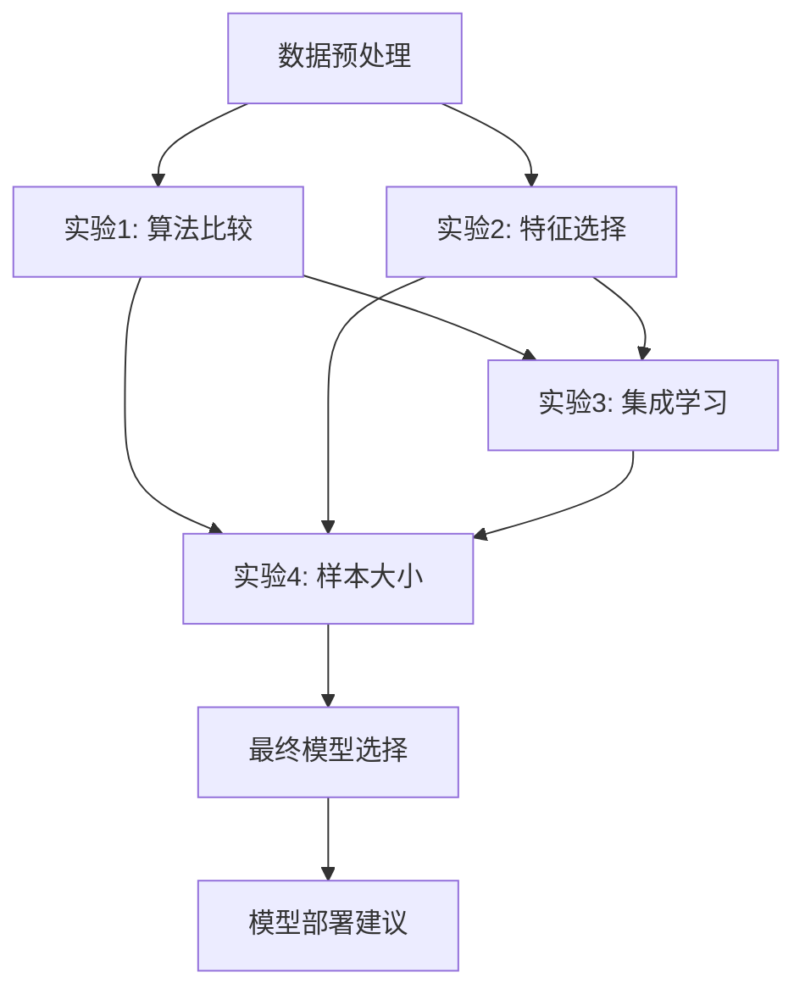

# CDS503 项目实验设计详细规划
## 首尔自行车共享系统需求预测 - 实验框架

---

## 总体实验设计原则

### 1. 数据分割策略
```python
# 时间序列数据分割（考虑时间顺序）
训练集: 2017年12月 - 2018年8月 (70% ≈ 6,132条)
验证集: 2018年9月 - 2018年10月 (15% ≈ 1,314条)  
测试集: 2018年11月 (15% ≈ 1,314条)
```

### 2. 评估指标体系
| 指标 | 公式 | 解释 | 阈值目标 |
|------|------|------|----------|
| **RMSE** | √(Σ(y_true - y_pred)²/n) | 均方根误差，主要指标 | < 200 |
| **MAE** | Σ\|y_true - y_pred\|/n | 平均绝对误差 | < 150 |
| **R²** | 1 - SS_res/SS_tot | 决定系数 | > 0.75 |
| **MAPE** | Σ\|y_true - y_pred\|/y_true/n × 100% | 平均绝对百分比误差 | < 25% |

### 3. 交叉验证方法
- **时间序列交叉验证**: 5折，确保训练数据时间早于验证数据
- **避免数据泄露**: 严格按时间顺序分割

---

## 实验1: 机器学习算法比较

### 负责人: 成员A
### 目标: 识别最适合的基础机器学习算法

### 算法选择与超参数网格

#### 1.1 线性回归 (Linear Regression)
```python
# 基础线性回归
from sklearn.linear_model import LinearRegression, Ridge, Lasso

# 超参数调优
algorithms = {
    'LinearRegression': LinearRegression(),
    'Ridge': Ridge(),
    'Lasso': Lasso()
}

ridge_params = {'alpha': [0.1, 1.0, 10.0, 100.0]}
lasso_params = {'alpha': [0.01, 0.1, 1.0, 10.0]}
```

#### 1.2 随机森林 (Random Forest)
```python
from sklearn.ensemble import RandomForestRegressor

rf_params = {
    'n_estimators': [100, 200, 300],
    'max_depth': [10, 20, 30, None],
    'min_samples_split': [2, 5, 10],
    'min_samples_leaf': [1, 2, 4],
    'max_features': ['auto', 'sqrt', 'log2']
}
```

#### 1.3 XGBoost回归
```python
import xgboost as xgb

xgb_params = {
    'n_estimators': [100, 200, 300],
    'learning_rate': [0.01, 0.1, 0.2],
    'max_depth': [3, 5, 7],
    'subsample': [0.8, 0.9, 1.0],
    'colsample_bytree': [0.8, 0.9, 1.0]
}
```

#### 1.4 支持向量机回归 (SVR)
```python
from sklearn.svm import SVR

svr_params = {
    'kernel': ['linear', 'rbf', 'poly'],
    'C': [0.1, 1, 10, 100],
    'gamma': ['scale', 'auto', 0.01, 0.1, 1],
    'epsilon': [0.01, 0.1, 1]
}
```

### 实验流程
1. **数据预处理**: 标准化数值特征，编码分类特征
2. **超参数调优**: GridSearchCV + 时间序列交叉验证
3. **模型训练**: 使用最优超参数训练模型
4. **性能评估**: 在测试集上评估所有指标
5. **结果分析**: 比较各算法优劣，选择前3名

### 预期产出
- 各算法性能比较表
- 超参数调优结果分析
- 模型训练时间对比
- 特征重要性分析（适用算法）

---

## 实验2: 特征选择方法

### 负责人: 成员B
### 目标: 找出最相关的特征组合，提升模型效果

### 特征工程预处理
```python
# 创建新特征
def feature_engineering(df):
    # 时间特征
    df['is_weekend'] = (df['Date'].dt.weekday >= 5).astype(int)
    df['month'] = df['Date'].dt.month
    df['quarter'] = df['Date'].dt.quarter
    df['hour_sin'] = np.sin(2 * np.pi * df['Hour'] / 24)
    df['hour_cos'] = np.cos(2 * np.pi * df['Hour'] / 24)
    
    # 交互特征
    df['temp_humidity'] = df['Temperature(°C)'] * df['Humidity(%)']
    df['temp_hour'] = df['Temperature(°C)'] * df['Hour']
    
    # 滞后特征（需要小心数据泄露）
    df['rent_lag_1h'] = df['Rented Bike Count'].shift(1)
    df['rent_lag_24h'] = df['Rented Bike Count'].shift(24)
    
    return df
```

### 特征选择方法

#### 2.1 相关性分析
```python
# 皮尔逊相关系数
correlation_threshold = 0.1
target_correlations = df.corr()['Rented Bike Count'].abs()
selected_features_corr = target_correlations[target_correlations > correlation_threshold].index.tolist()
```

#### 2.2 递归特征消除 (RFE)
```python
from sklearn.feature_selection import RFE
from sklearn.ensemble import RandomForestRegressor

# 使用随机森林作为基础估计器
rf_estimator = RandomForestRegressor(n_estimators=100, random_state=42)
rfe_selector = RFE(estimator=rf_estimator, n_features_to_select=10, step=1)
```

#### 2.3 LASSO回归特征选择
```python
from sklearn.linear_model import LassoCV

# 自动选择alpha参数
lasso_cv = LassoCV(cv=5, random_state=42)
lasso_cv.fit(X_train, y_train)
selected_features_lasso = X_train.columns[lasso_cv.coef_ != 0].tolist()
```

#### 2.4 基于树的特征重要性
```python
import xgboost as xgb

# XGBoost特征重要性
xgb_model = xgb.XGBRegressor(n_estimators=100, random_state=42)
xgb_model.fit(X_train, y_train)
feature_importance = xgb_model.feature_importances_
top_k_features = X_train.columns[np.argsort(feature_importance)[-10:]].tolist()
```

### 实验流程
1. **特征工程**: 创建时间、交互、滞后特征
2. **特征选择**: 应用4种不同的特征选择方法
3. **模型验证**: 使用选定特征训练模型并评估
4. **特征组合**: 尝试不同特征子集的组合
5. **最优选择**: 选择性能最佳的特征组合

### 预期产出
- 各特征选择方法结果对比
- 特征重要性排序
- 特征组合优化结果
- 降维效果分析

---

## 实验3: 集成学习方法

### 负责人: 成员C
### 目标: 通过集成学习提升模型性能

### 集成方法设计

#### 3.1 Bagging方法
```python
from sklearn.ensemble import BaggingRegressor
from sklearn.tree import DecisionTreeRegressor

# Bootstrap聚合
bagging_params = {
    'n_estimators': [10, 50, 100],
    'max_samples': [0.5, 0.7, 1.0],
    'max_features': [0.5, 0.7, 1.0],
    'bootstrap': [True, False]
}
```

#### 3.2 Boosting方法
```python
from sklearn.ensemble import AdaBoostRegressor, GradientBoostingRegressor

# AdaBoost
ada_params = {
    'n_estimators': [50, 100, 200],
    'learning_rate': [0.01, 0.1, 1.0],
    'loss': ['linear', 'square', 'exponential']
}

# Gradient Boosting
gb_params = {
    'n_estimators': [100, 200],
    'learning_rate': [0.05, 0.1, 0.2],
    'max_depth': [3, 5, 7],
    'subsample': [0.8, 1.0]
}
```

#### 3.3 Voting回归器
```python
from sklearn.ensemble import VotingRegressor

# 软投票集成
voting_regressor = VotingRegressor([
    ('rf', RandomForestRegressor(n_estimators=100)),
    ('xgb', xgb.XGBRegressor(n_estimators=100)),
    ('svr', SVR(kernel='rbf'))
])
```

#### 3.4 Stacking
```python
from sklearn.ensemble import StackingRegressor
from sklearn.linear_model import LinearRegression

# 二层堆叠
base_models = [
    ('rf', RandomForestRegressor(n_estimators=100)),
    ('xgb', xgb.XGBRegressor(n_estimators=100)),
    ('svr', SVR(kernel='rbf'))
]

stacking_regressor = StackingRegressor(
    estimators=base_models,
    final_estimator=LinearRegression(),
    cv=5
)
```

### 实验流程
1. **基础模型选择**: 基于实验1结果选择最佳基础模型
2. **集成方法应用**: 分别尝试4种集成方法
3. **超参数调优**: 对每种集成方法进行参数优化
4. **性能比较**: 与基础模型性能对比
5. **复杂度分析**: 评估计算复杂度和训练时间

### 预期产出
- 各集成方法性能对比
- 基础模型vs集成模型效果分析
- 模型复杂度与性能权衡分析
- 最优集成策略推荐

---

## 实验4: 训练样本大小影响

### 负责人: 成员D
### 目标: 分析训练数据量对模型性能的影响

### 实验设计
```python
# 学习曲线实验
train_sizes = np.arange(0.1, 1.1, 0.1)  # 10% 到 100%，步长10%
selected_models = [
    '实验1最佳模型',
    '实验2最佳特征+模型',
    '实验3最佳集成模型'
]
```

### 详细实验步骤

#### 4.1 数据子集创建
```python
def create_training_subsets(X_train, y_train, train_sizes):
    subsets = {}
    base_size = len(X_train)
    
    for size in train_sizes:
        n_samples = int(base_size * size)
        # 保持时间顺序，从开始取样
        X_subset = X_train[:n_samples]
        y_subset = y_train[:n_samples]
        subsets[size] = (X_subset, y_subset)
    
    return subsets
```

#### 4.2 学习曲线绘制
```python
from sklearn.model_selection import learning_curve

def plot_learning_curves(model, X, y, train_sizes):
    train_sizes_abs, train_scores, test_scores = learning_curve(
        model, X, y, cv=5, train_sizes=train_sizes,
        scoring='neg_mean_squared_error', random_state=42
    )
    
    # 绘制学习曲线
    plt.figure(figsize=(10, 6))
    plt.plot(train_sizes_abs, -train_scores.mean(axis=1), 'o-', label='训练集')
    plt.plot(train_sizes_abs, -test_scores.mean(axis=1), 'o-', label='验证集')
    plt.xlabel('训练样本数量')
    plt.ylabel('RMSE')
    plt.legend()
    plt.title('学习曲线')
```

#### 4.3 性能变化分析
```python
# 分析性能指标随数据量的变化
metrics_vs_size = {
    'train_size': [],
    'rmse': [],
    'mae': [],
    'r2': [],
    'training_time': []
}
```

### 分析内容
1. **性能曲线**: 各模型在不同数据量下的性能变化
2. **收敛分析**: 确定性能稳定所需的最少数据量
3. **过拟合检测**: 训练集vs验证集性能差异分析
4. **效率评估**: 训练时间与数据量的关系
5. **成本效益**: 数据收集成本vs性能提升权衡

### 预期产出
- 学习曲线图表
- 性能饱和点分析
- 数据需求建议
- 过拟合/欠拟合诊断报告

---

## 跨实验比较与综合分析

### 最终模型选择标准
| 标准 | 权重 | 评估方法 |
|------|------|----------|
| 预测准确性 | 40% | RMSE < 200，R² > 0.75 |
| 模型稳定性 | 25% | 交叉验证标准差 < 20 |
| 计算效率 | 20% | 训练时间 < 300秒 |
| 可解释性 | 15% | 特征重要性清晰度 |

### 综合实验流程


### 实验时间安排
| 周次 | 实验1 (成员A) | 实验2 (成员B) | 实验3 (成员C) | 实验4 (成员D) |
|------|---------------|---------------|---------------|---------------|
| 第3周 | 算法调研，基础实现 | 特征工程设计 | 集成方法调研 | 实验框架设计 |
| 第4周 | 超参数调优 | 特征选择实验 | 基础模型训练 | 等待前期结果 |
| 第5周 | 结果分析 | 特征组合优化 | 集成方法实现 | 学习曲线实验 |
| 第6周 | 模型解释 | 最优特征确定 | 集成调优 | 综合分析 |

### 文档化要求
每个实验需要产出：
1. **实验代码**: 完整可重现的Python脚本
2. **结果报告**: 详细的性能分析和可视化
3. **方法论总结**: 实验设计和执行过程
4. **问题记录**: 遇到的问题和解决方案

---

## 预期挑战与解决预案

### 技术挑战
1. **时间序列特性**: 使用适当的交叉验证方法
2. **计算资源限制**: 合理选择超参数搜索范围
3. **模型过拟合**: 严格的验证集划分和正则化
4. **特征维度高**: 系统性特征选择和降维

### 时间管理
- 每周例会同步进度
- 关键节点里程碑检查
- 预留缓冲时间处理意外问题

### 质量保证
- 代码review机制
- 结果交叉验证
- 文档标准化格式

通过这个系统性的实验设计，我们将能够深入分析首尔自行车共享数据，找到最优的预测模型，并为实际应用提供可靠的解决方案。 